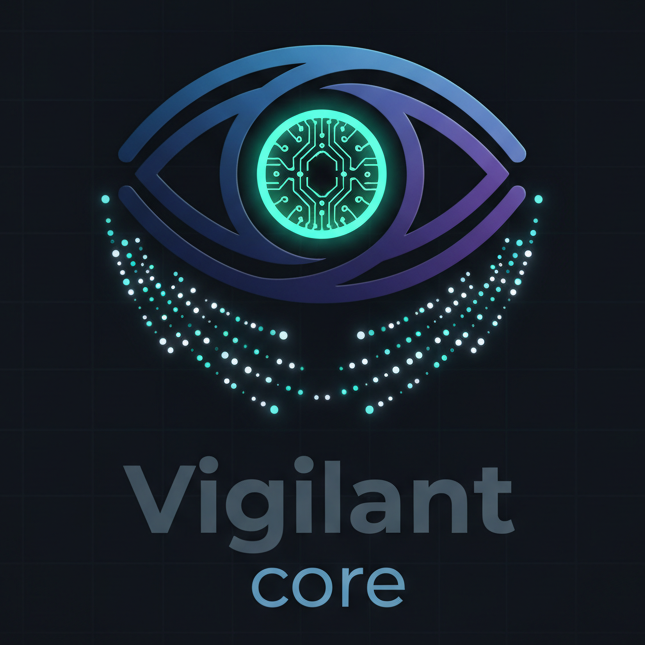

# VigilantCore

[](https://github.com/nikolareljin/vigilant-core/actions/workflows/ci.yml)
[](https://github.com/nikolareljin/vigilant-core/actions/workflows/compatibility.yml)




VigilantCore is a local, cross-platform monitoring app that tracks **Impactful Events** for a specific subject, using a local LLM (Ollama) to score impact and generate predictive outcomes. It is designed to be simple for non-technical users while still offering an AI-driven, location-aware signal.

**All AI processing happens locally on your computer - no data is sent to external servers.**

---

## 🚀 Quick Start

**Get started in one command:**

- **Linux/macOS:** 

```bash
curl -fsSL https://raw.githubusercontent.com/nikolareljin/vigilant-core/main/scripts/quickstart.sh | bash
```

- **Windows:** 
  
```powershell
git clone https://github.com/nikolareljin/vigilant-core.git
cd vigilant-core
.\scripts\quickstart.ps1
```

[**→ Jump to detailed installation instructions**](#quickstart-one-command-setup)

---

## Key Features

- **AI-Powered Insights**: Ask specific monitoring questions and get AI-generated answers
- **Impact Scoring**: Every alert scored 1-10 for relevance and urgency
- **Location-Aware**: Filter alerts by ZIP code, coordinates, or radius
- **Automatic Local Discovery**: When you provide a ZIP code, automatically finds:
  - NWS weather alerts for your state
  - Local police, fire, and emergency management alerts
  - Power outage maps (including `poweroutage.us` search coverage) and utility alerts
  - Water, gas, solar, and wind infrastructure incident signals
  - Transportation/traffic/transit/airport and airline disruption signals
  - Local news and government sources
- **Context-Aware Extreme Event Coverage**: Flooding, tornadoes, wildfires, winter storms, earthquakes, industrial incidents, and conflict/crisis monitoring queries
- **International Regional Coverage**: Canada, Europe (priority), North Africa, China/Far East, Australia, South Africa, Central America, South America, plus broader Middle East/South Asia/Southeast Asia/Sub-Saharan Africa/global fallback
- **Coordinate-First Source Discovery**: Latitude/longitude alone can infer region and automatically seed relevant regional source URLs and localized Google News feeds
- **Source Preview UI/API**: Setup page preview and `/api/source-preview` endpoint show the inferred region and curated source URLs before saving
- **Source Health Indicators**: Track per-source last successful fetch time, cumulative error count, and latest fetch latency in the dashboard and `/api/source-health`
- **AI Suggested Actions Toggle**: Enable/disable actionable suggestions shown next to the AI insight result from settings
- **Unified Event Normalization**: All alerts are normalized into a consistent schema with `severity`, `confidence`, UTC-normalized timestamps, and structured location fields
- **Event Deduplication Engine**: Overlapping alerts from different feeds/search providers are merged into one canonical event with aggregated source attribution
- **SQLite Local Cache**: Stores normalized alerts plus `event_history` and `source_metadata` records for traceable local event persistence
- **Multiple Data Sources**: NewsAPI, DuckDuckGo, Google CSE, RSS feeds, local discovery, and curated global sources (including disaster/crisis signal sources)
- **Cross-Platform**: Web dashboard and Qt desktop app
- **Privacy-First**: All processing done locally via Ollama

## User Journey
1. **First Run**: Open the app, enter your subject, location, and optional RSS feeds/API key.
2. **Set Monitoring Question**: Ask a specific question like "When is the peak risk of power outage?"
3. **Live Impact Feed**: The dashboard shows scored alerts with AI-generated insights (timestamps use the host's local time by default, or `DISPLAY_TIMEZONE` if set in `.env`).
4. **Impact Scoring**: Each alert is ranked from 1–10 based on relevance and urgency.
5. **Stay Informed**: New alerts appear in near real-time and are stored locally.

## Impact Score Logic (Overview)
- **1–3**: Low relevance or weak impact.
- **4–6**: Moderate impact or early advisory signals.
- **7–10**: High-impact events, warnings, or imminent disruptions.

## Location Matching
VigilantCore prefers local signals by combining:
- ZIP-based geocoding (offline) to a center point.
- Radius filtering (default 50km).
- Keyword matching on location name and ZIP.

## Automatic Local Source Discovery

When you provide a ZIP code or coordinates, VigilantCore automatically discovers relevant local sources:

**Weather & Emergency Alerts:**
- NWS (National Weather Service) CAP alerts for your state
- Severe weather warnings and advisories

**Emergency Services:**
- Local police department alerts
- Fire department news
- County emergency management updates
- Road closures and travel advisories

**Utilities:**
- Power company outage information
- Electric utility service alerts
- Water utility advisories and boil-water alerts
- Gas utility emergencies and leak notices
- Renewable energy infrastructure incidents (solar/wind) when relevant

**Local News:**
- County/city government news feeds
- Local newspaper RSS feeds

**Transportation & Critical Infrastructure:**
- Traffic and DOT incident updates
- Transit/rail service disruption alerts
- Airport/airline delay and cancellation signals

**Global Crisis / Conflict (subject-driven):**
- If your subject mentions war/conflict/crisis terms, VigilantCore expands search/feed queries for international conflict and humanitarian risk updates

**International Regions (location/lat-lon aware):**
- Regional source URLs and searches are automatically prioritized for Canada, Europe, North Africa, China/Far East, Australia, South Africa, Central America, and South America
- Additional fallback coverage includes Middle East, South Asia, Southeast Asia, and Sub-Saharan Africa where public sources are available

## Regional Source Discovery (Detailed)

VigilantCore now uses a layered source-discovery approach for outage/extreme-event monitoring:

1. **Infer region** from ZIP code, location text, or latitude/longitude (lat/lon works by itself).
2. **Select curated regional URLs** (utilities, emergency agencies, weather services, transport/aviation operations, and major regional news).
3. **Generate localized Google News RSS feeds** using region-specific locale settings (`gl`, `hl`, `ceid`).
4. **Expand context-aware searches** for utilities, transportation, disasters, and conflict/humanitarian crises.
5. **Discover RSS feeds** from candidate sites and merge with user-provided feeds and other search/API sources.

This improves coverage in places where direct RSS feeds are inconsistent or unavailable.

## Event Deduplication

Before AI parsing and SQLite persistence, VigilantCore de-duplicates incoming alerts by:

- URL-level duplicate suppression
- semantic overlap checks (title/body token similarity)
- event-time proximity checks (default 6-hour overlap window, applied only when both events have timestamps)

When multiple sources describe the same incident, VigilantCore stores a single merged event and combines source attribution (for example: `Source A | Source B`).

See `docs/event-deduplication.md` for detailed deduplication behavior.

### Coordinate-First Behavior

If you provide only coordinates:

- `latitude`
- `longitude`

VigilantCore can still:

- infer an approximate region
- select localized regional source URLs
- generate localized Google News feeds
- preview the selected region/sources before saving

### Source Preview (Web Setup + API)

The setup page includes a **Regional Source Preview** panel that shows:

- inferred region key/label
- curated source URL count
- curated source URLs that will be prioritized
- coordinate values are range-validated before region inference (`lat=-90..90`, `lon=-180..180`)

Programmatic preview:

```bash
curl "http://127.0.0.1:8765/api/source-preview?latitude=48.8566&longitude=2.3522"
```

Another example:

```bash
curl "http://127.0.0.1:8765/api/source-preview?location_name=Toronto,%20Ontario,%20Canada"
```

See `docs/source-discovery.md` for the full coverage list and implementation behavior.

For example, ZIP code `08544` (Princeton, NJ) automatically adds NWS New Jersey alerts, searches for PSE&G outage info, and finds Mercer County emergency resources.

## Requirements
- **Python 3.10+** (Linux/macOS)
- **Python 3.12** (Windows)
- Git (for cloning/updating)
- Ollama (automatically installed by quickstart scripts)

## Quickstart (One-Command Setup)

Choose the command for your operating system:

| Platform | Command |
|----------|---------|
| **Linux** | `curl -fsSL https://raw.githubusercontent.com/nikolareljin/vigilant-core/main/scripts/quickstart.sh \| bash` |
| **macOS** | `curl -fsSL https://raw.githubusercontent.com/nikolareljin/vigilant-core/main/scripts/quickstart.sh \| bash` |
| **Windows (PowerShell)** | `.\scripts\quickstart.ps1` (after cloning repo) |
| **Windows (CMD)** | `.\scripts\quickstart.bat` (after cloning repo) |

### Linux/macOS

**From anywhere on your system (no repository needed):**
```bash
curl -fsSL https://raw.githubusercontent.com/nikolareljin/vigilant-core/main/scripts/quickstart.sh | bash
```

or with wget:
```bash
wget -qO- https://raw.githubusercontent.com/nikolareljin/vigilant-core/main/scripts/quickstart.sh | bash
```

**If you already have the repository:**
```bash
./scripts/quickstart.sh
```

### Windows

**Step 1: Clone the repository (first time only)**
```powershell
git clone https://github.com/nikolareljin/vigilant-core.git
cd vigilant-core
```

**Step 2: Run the quickstart script**

**PowerShell (Recommended):**
```powershell
.\scripts\quickstart.ps1 -TargetDir "."
```

**Command Prompt:**
```cmd
set TARGET_DIR=.
.\scripts\quickstart.bat
```

> **Note:** Unlike Linux/macOS, Windows users need to clone the repository first. The remote curl/wget approach doesn't work well on Windows due to PowerShell execution policies.

**What the quickstart scripts do:**
- ✅ Ensure Python 3.12 is available on Windows (auto-installs if missing)
- ✅ Install/check Git
- ✅ Clone or update the repository
- ✅ Create and activate virtual environment
- ✅ Install all Python dependencies
- ✅ **Install Ollama CLI** (via official installer or winget)
- ✅ **Start Ollama service**
- ✅ **Download default AI model** (llama3.2:1b - ~900MB)
- ✅ Launch the web dashboard at http://127.0.0.1:8765

**First-time setup takes 5-10 minutes** (mostly downloading the AI model). Subsequent runs are instant.

### Platform-Specific Notes

**Linux:**
- Requires `curl` or `wget` for remote installation
- Ollama installed via official script from ollama.com
- May require `sudo` for some package installations

**macOS:**
- Requires Homebrew for Ollama installation
- If Homebrew not installed, get it from [brew.sh](https://brew.sh)
- All installations work without sudo

**Windows:**
- **Python 3.12 required** for consistent Windows dependency support
- Requires [winget](https://learn.microsoft.com/en-us/windows/package-manager/winget/) for automatic Ollama installation
- winget included with Windows 11 and Windows 10 (recent versions)
- Alternative: Manual Ollama download from [ollama.com/download](https://ollama.com/download)
- PowerShell: Run as user (no admin needed)
- Command Prompt: Run as user (no admin needed)

### Troubleshooting Quickstart

**"Ollama installation failed"**
- Download and install manually from [ollama.com/download](https://ollama.com/download)
- Run the quickstart script again after installation

**"Model download is slow"**
- The llama3.2:1b model is ~900MB
- Speed depends on your internet connection
- You can cancel (Ctrl+C) and continue later with: `ollama pull llama3.2:1b`

**"Python not found" or "Git not found"**
- **Windows:** Install Python 3.12.x from [python.org](https://www.python.org/downloads/windows/)
- If quickstart auto-installs Python, close the current terminal and run quickstart again so PATH changes are picked up
- **Linux/macOS:** Install Python 3.10+ from your package manager or [python.org](https://www.python.org/downloads/)
- Install Git from [git-scm.com](https://git-scm.com/downloads)
- Ensure both are added to your system PATH

## Manual Installation

If you prefer manual setup or the quickstart script doesn't work for your system:
1. Clone the repository
2. Run the launcher script:

**Linux/macOS:**
```bash
./run.sh          # Start web dashboard (default)
./run.sh qt       # Start Qt desktop app
./run.sh both     # Start both (web in background)
./run.sh stop     # Stop all instances
./run.sh status   # Check what's running
```

**Windows:**
```cmd
run.bat           # Start web dashboard
run.bat qt        # Start Qt desktop app
run.bat stop      # Stop all instances
```

The launcher will automatically create a virtual environment and install dependencies.

### Web Dashboard

Configure the dashboard:


In the examples above, public location was defined with Longitude/Latitude. You can use your own location, ZIP code, address and longitude/latitude.

Open your browser to: **http://127.0.0.1:8765**


Initial results of the search.

Results view with the AI generated content:


### Qt Desktop App

Launch with `./run.sh qt` (or `run.bat qt` on Windows).


Results view with the AI generated content:


## Monitoring Question & AI Insights

The **Monitoring Question** feature lets you ask specific questions about your monitored subject. The AI analyzes recent alerts and generates focused insights.

**Example questions:**
- "What is the expected time of highest risk of power outage in my area?"
- "Should I clear my driveway now, or wait until the snow stops?"
- "Are there any travel advisories affecting I-95?"

The insight appears as an expandable card above the alerts list, showing:
- **Summary**: Brief answer to your question
- **Explanation**: Detailed analysis with supporting evidence

Configure refresh interval in Settings under "AI Settings".

## Web Dashboard

The web interface is available at: **http://127.0.0.1:8765**

Settings page prompts for:
- **Event/Subject** - What to monitor
- **Monitoring Question** - Specific question for AI insights
- **Location / ZIP / GPS** - Geographic filtering
- **Radius (km)** - Search area
- **AI Settings** - Model preferences, insight refresh rate
- **Data Sources** - RSS feeds, API keys
- **Source Health Indicators** - Per-source fetch health table (last success, errors, latency, and item counts)

Additional data view: `http://127.0.0.1:8765/data`

## Zero-Input Discovery
If you provide no RSS feeds or API keys, VigilantCore will still:
- Auto-detect your city/region + ZIP + coordinates (best effort).
- Seed from **30 curated global sources** and discover RSS/Atom feeds.
- Add a Google News RSS query built from your subject + location for broader coverage.
- Add local public-safety queries (police, sheriff, fire, emergency management).
- Attempt to discover local police/government and local news RSS feeds near your location.
- Pull social chatter via Reddit search RSS tied to your subject and location.

### RSS Feeds vs Curated Sources
By default, any RSS feeds you add are *merged* with the built-in curated sources.
If you want to use only the RSS feeds you provide, enable **"Only use RSS feeds listed above"** in Settings.
To skip RSS entirely and use only API/search providers, enable **"Disable RSS fetching"**.

### Polling Interval
You can control how often the app checks for new data (default **5 minutes**).
- Web UI: **Polling interval (minutes)**
- Qt UI: **Polling interval (minutes)**

## Optional Search API Keys (Better Coverage)
If you set any of the API keys below, VigilantCore will use them automatically. If not set, it falls back to RSS and the built-in discovery.

### Google Programmable Search Engine (CSE)
1. Create a Custom Search Engine and set it to **Search the entire web**:
   https://programmablesearchengine.google.com/
2. Enable the Custom Search JSON API and create an API key:
   https://developers.google.com/custom-search/v1/overview
3. Set:

```bash
GOOGLE_CSE_API_KEY=your_key
GOOGLE_CSE_CX=your_search_engine_id
```

### Bing Web Search API
1. Create a Bing Search v7 resource in Azure:
   https://learn.microsoft.com/en-us/bing/search-apis/bing-web-search/create-bing-search-service-resource
2. Set:
```bash
BING_SEARCH_KEY=your_key
# Optional overrides
BING_SEARCH_ENDPOINT=https://api.bing.microsoft.com/v7.0/search
BING_SEARCH_MARKET=en-US
BING_SEARCH_SAFE=Moderate
```

### DuckDuckGo Web Search (No Key Required)
DuckDuckGo HTML search is available without an API key. Enable/disable it in Settings:
- Web UI: **Enable DuckDuckGo web search**
- Qt UI: **Enable DuckDuckGo web search**

### Tethered / Low-Bandwidth Mode
If you are on a mobile hotspot or tethered connection, enable:
- Web UI: **Optimize for tethered / low-bandwidth connection**
- Qt UI: **Optimize for tethered / low-bandwidth connection**

This mode reduces request volume by limiting source discovery/query budgets and capping feed polling/discovery breadth.

### Facebook & Instagram (Meta Graph API)
Meta does not provide a general public search API. Access typically requires:
- A Meta app with approved permissions
- A specific Page/IG Business account context
If you have a Page or IG Business and want targeted ingestion, open an issue and we can add a provider for specific page IDs.

### Curated Global Sources (Expanded)
The default list now includes major US, European, East European, Chinese, Australian, South American, and African outlets. See `vigilant-core/utils/sources.py` for the full list.

## Helper Scripts (script-helpers)
This repo can use the shared `script-helpers` library like other projects in this workspace.
If the submodule is not present (e.g., CI), scripts fall back to minimal logging.
To use full helpers locally, initialize submodules once:
```bash
./update
```

## Single-Command Install & Run (All Major Platforms)
These commands create a local virtual environment, install dependencies, and launch the app.

### macOS / Linux
```bash
python3 -m venv venv && source venv/bin/activate && pip install -r requirements.txt && python src/main.py
```

### Windows (PowerShell)
```powershell
py -3.12 -m venv venv; .\\venv\\Scripts\\Activate.ps1; pip install -r requirements.txt; python src\\main.py
```

### Windows (CMD)
```bat
py -3.12 -m venv venv && call venv\\Scripts\\activate && pip install -r requirements.txt && python src\\main.py
```

## One-Command Install Scripts
For non-technical users, these scripts handle setup + launch:

### macOS / Linux
```bash
./install.sh
```

### Windows (PowerShell)
```powershell
./install.ps1
```

## One-Click Packaging (Executable)
Build a native app bundle so non-technical users can run without Python:
```bash
pyinstaller --onefile --windowed src/main.py --name VigilantCore
```

## CI Automation (ci-helpers)
GitHub Actions uses the reusable workflows from `ci-helpers` to lint, test, and build:
- Workflow file: `.github/workflows/ci.yml`
- Reusable workflow: `nikolareljin/ci-helpers/.github/workflows/python.yml@production`

## Developer Setup
```bash
python -m venv venv
source venv/bin/activate
pip install -r requirements.txt
python src/main.py
```

## Local LLM
By default, the app uses `qwen2.5:7b` from Ollama. If RAM is 8GB or less, it auto-falls back to `qwen2.5:3b` unless `OLLAMA_MODEL` is set. You can override with:
```bash
export OLLAMA_MODEL=qwen2.5:7b
```

## Packaging (One-Click App)
```bash
pyinstaller --onefile --windowed src/main.py --name VigilantCore
```

## Repository Tips
- **Repo name**: `vigilant-core`
- **Branch protection**: Require PR reviews before merging into `main`.
### NewsAPI Time Window
You can control how recent NewsAPI results should be. Default is **6 hours**.
- Web UI: **News time window (hours)**
- Qt UI: **News time window (hours)**

### NewsAPI Sort Order
Default is **popularity**. You can also choose **publishedAt** or **relevancy** from the Settings UI.

## Documentation

Full documentation is available in the `docs/` folder:

- [Installation Guide](docs/installation.md) - Detailed setup instructions
- [Configuration Guide](docs/configuration.md) - All configuration options
- [Features](docs/features.md) - Complete feature documentation
- [Examples](docs/examples.md) - Real-world usage examples (winter storms, power outages, etc.)

## Changelog

See [CHANGELOG.md](CHANGELOG.md) for release history and changes.
Event schema details: [docs/event-normalization.md](docs/event-normalization.md)
